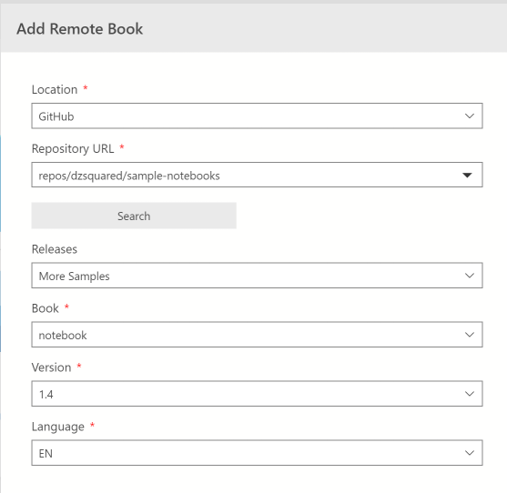

# 📘 Create a Remote Jupyter Book Release

Use this action to create a GitHub release for your Jupyter book, quickly making it accessible as a remote Jupyter book in Azure Data Studio.

<p align="center">
  <a href="https://github.com/actions/typescript-action/actions"></a>
</p>


## 🚄 Usage Guide

### Manual Start from Workflow Form
In its simplest form, this action can be manually triggered in the browser on the Actions tab for a repository.


To setup the workflow for a manual trigger, create a new GitHub Action workflow and replace the workflow with the following:

```yml
# This is a basic workflow that is manually triggered
name: Remote Jupyter Book

# Controls when the action will run. Workflow runs when manually triggered using the UI
on:
  workflow_dispatch:
    # Inputs the workflow accepts.
    inputs:
      directory:
        description: 'Jupyter Book to Release (defaults to whole repository)'
        default: '.'
        required: true
      releasename:
        description: 'Release name'
        required: true
      bookname:
        description: 'Book name'
        required: true
      versionnumber:
        description: 'Version number'
        required: true
      languageid:
        description: 'Language id'
        default: 'EN'
        required: true

# A workflow run is made up of one or more jobs that can run sequentially or in parallel
jobs:
  RemoteBook:
    runs-on: ubuntu-latest
    steps:
      - name: Checkout code
        uses: actions/checkout@v2
      - name: Publish book
        uses: dzsquared/jupyter-publish-action@v0.1.0
        with:
          directory: ${{ github.event.inputs.directory }}
          releasename:  ${{ github.event.inputs.releasename }}
          bookname: ${{ github.event.inputs.bookname }}
          versionnumber: ${{ github.event.inputs.versionnumber }}
          languageid: ${{ github.event.inputs.languageid }}
          githubtoken: ${{ secrets.GITHUB_TOKEN }}

```

### Other Workflows

The action can be used with other triggers, provided that the inputs are obtained or statically set.  I'd love to hear how this is used, please feel free to open an issue to share your scenario!


## 🛠 Inputs

### `directory`
This input defaults to `.`, or the root of the repository.  If the folders for the Jupyter book, such as `content` and `_data`, are nested within the repository, change this value to their location.  Changing this value is not a typical scenario for a repository with a single Jupyter book.

### Azure Data Studio fields

- `releasename` = Releases
- `bookname` = Book
- `versionnumber` = Version
- `languageid` = Language


### `githubtoken`
This is a token specific to the repository and the action runtime.  You do not need to generate a token or do anything but put the value `${{ secrets.GITHUB_TOKEN }}`.

## 🧪 Sample
There's a live sample of this action at https://github.com/dzsquared/sample-notebooks.

## ⚖ License
This project is licensed under the [MIT license](https://github.com/dzsquared/jupyter-publish-action/blob/main/LICENSE).

## 🧩 Contributing
This is a small project without any technical contribution guidelines.  All contributors must abide by the [Contributor Covenant Code of Conduct](./CONTRIBUTING.md).

## ⏳ Release Notes
### v0.1.0
First preview release.

### v0.0.1-0.0.23
Testing and developing in the open.  It was messy, but it got us here.
